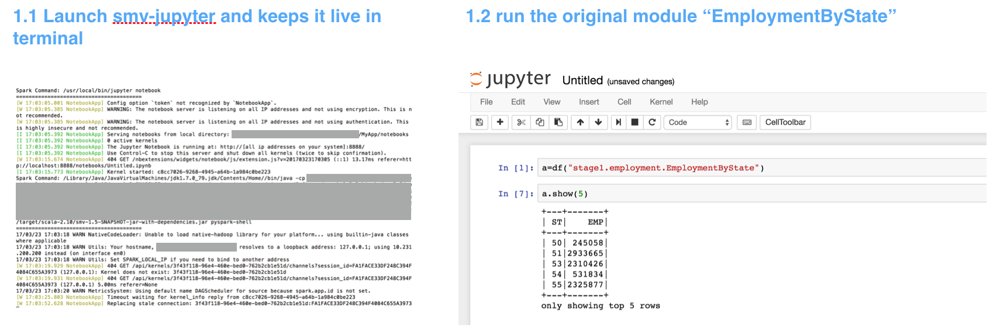
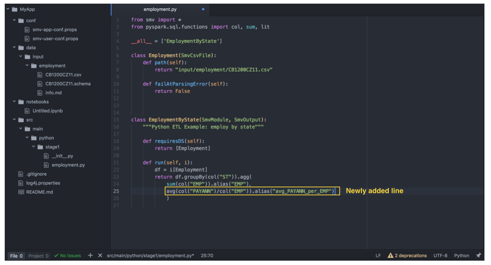
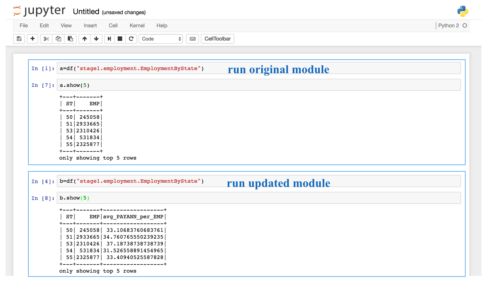
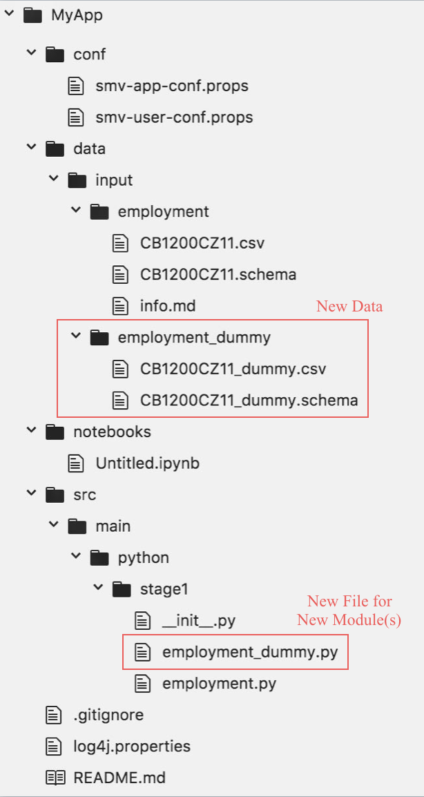

# Data and Project Development
We will briefly discuss the data and project development in this section, and the example MyApp will continue to serve as the example.

## Add / Modify Modules
### Existing Data and Existing Module
Currently under `stage1/employment.py` there are 2 modules, `Employment` is to load the input data, and `EmploymentByState` is to do an aggregation on the data. Like what we have discussed in the previous [Identify Insights Section](../../MyApp_smv_example/notebooks/Identify_Insights.ipynb), assume you would like to add average annual payroll per employee as another aggregated variable, what you need to do is simply add one more line into the existing module:
```python
class EmploymentByState(SmvModule, SmvOutput):
    """Python ETL Example: employ by state"""

    def requiresDS(self):
        return [Employment]

    def run(self, i):
        df = i[Employment]
        return df.groupBy(col("ST")).agg(
          sum(col("EMP")).alias("EMP"),
          avg(col("PAYANN")/col("EMP")).alias("avg_PAYANN_per_EMP")  #add this line
          )
```
Remember to import relevant functions from native `pyspark` or change the import definition to ```from pyspark.sql.functions import *```

### Existing Data and New Module
If you would like to create a new module, you can either add another `class` in the same `.py` file or create a new `.py` for additional modules, for example like below:  
```python
class PayEMPByState(SmvModule, SmvOutput):      #add a new module
    """Python ETL Example: average payroll per employee by state"""

    def requiresDS(self):
        return [Employment]  #still use the same input

    def run(self, i):
        df = i[Employment]
        return df.groupBy(col("ST")).agg(
          avg(col("PAYANN")/col("EMP")).alias("avg_PAYANN_per_EMP")  
          )
```

### New Data and New Module
After we have prepared the new data (for example CB1200CZ11_dummy.csv) and would like to create modules, there are 2 major steps.

1.Define the new file
Like what we have seen in `employment.py`, we can create a `employment_dummy.py` in stage1 to define the new file like below:
```python
class EmploymentDummy(SmvCsvFile):
    def path(self):
        return "input/employment_dummy/CB1200CZ11_dummy.csv"

    def dqm(self):
        """An example DQM policy"""
        return SmvDQM().add(FailParserCountPolicy(10))
```
The simplest definition is just to specify the file path, users can also specify DQM rules to control the quality of the input data. For details of **SMV DQM**, please refer to [this guide](https://github.com/TresAmigosSD/SMV/blob/master/docs/user/dqm.md).

2.Create a new module. Assume with this new piece of data, we want to know total # of establishments per state, then we can create a module like below:
```python
class EstabByState(SmvModule, SmvOutput):
    """Python ETL Example: establishments by state"""

    def requiresDS(self):
        return [EmploymentDummy]

    def run(self, i):
        df = i[EmploymentDummy]
        return df.groupBy(col("ST")).agg(
                sum(col("ESTAB")).alias("sum_ESTAB")
                )
```

## Test the Changes - Dynamic Loading
One powerful functionality of SMV is the dynamic loading: meaning that the changes in the code can be dynamically loaded, and if you are using jupyter notebook to run a module, there is no need to close or relaunch jupyter notebook so as to run the latest change of modules. This makes testing new or updated modules very efficient and convenient.

We will take the example in [Existing Data and Existing Module](#existing-data-and-existing-module) as example.  
1.Before adding the new aggregated variable, users may launch `smv-jupyter` and run the original module.


2.Edit the module to add the aggregated variable in editor. One recommended editor is [Atom](https://github.com/TresAmigosSD/SMV/blob/master/docs/user/atom.md).



3.Test the updated module in the same jupyter notebook (no need to shut down or relaunch)

You can see it is very easy to test new or updated modules with SMV, such that the project development can be smooth and efficient. Give it a try on new modules!

## Review the project hierarchy
Now your project hierarchy is like below, and it is easy to continue to create more modules as you can imagine.

