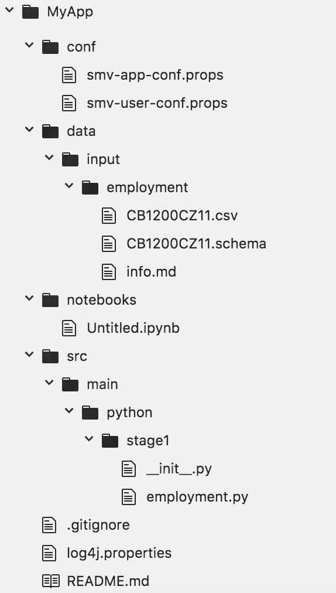

# Initialize a Project

## Project Initialization with SMV
SMV offers a convenient tool `smv-init` for project initialization. `smv-init` has an option for users to select the type of project to create, and currently there are three types of projects:  
1) `-s` simple (default): for users who are relatively new to smv to get a quick start;  
2) `-e` enterprise: for users who need to have a relatively complicated project (enterprise solution)
3) `-t` test: for developers only

We can start from the simplest one. After running the command `smv-init -s MyApp`, a project named "MyApp" has been created and the hierarchy of the project directory will look like below:



## The Key Components in the Project Directory
`MyApp`: project root directory
- folder `conf`: app level and user configuration files.
- folder `data`: main directory for input/output data
  - folder `input`: the location for input data.  
- folder `notebooks`: default location for Jupyter notebooks (which we have discussed in Section II)
- folder `src/main/python/`: all source scripts for data processing and analyzing, each folder represents a [SmvStage](https://github.com/TresAmigosSD/SMV/blob/master/docs/user/smv_stages.md).
- file `.gitignore`: manages the paths and files to be ignored in git commit
- file `README.md`: introduction document for this project

## SMV Framework
Before going into details, we will firstly introduce some important concepts in the framework of SMV.

### SMV Module
[SmvModule](https://github.com/TresAmigosSD/SMV/blob/master/docs/user/smv_module.md) is one of core objects in Smv framework. Essentially a module is a collection of transformation operations and validation rules. Each module depends on one or more [`SmvDataSet`](https://github.com/TresAmigosSD/SMV/blob/master/docs/user/smv_intro.md#smvdataset) and defines a set of transformation on its inputs that define the module output. For example, `EmploymentByState` in `src/main/python/stage1/employment.py` is an SMV module.  

One key advantage of the modularized design is it allows users to break down a complicated data analytics process into small and clear pieces, which can benefit project, team and time management.  

### SMV Stage
As a project grows in size, the ability to divide up the project into manageable chunks becomes paramount. [SMV Stage](https://github.com/TresAmigosSD/SMV/blob/master/docs/user/smv_stages.md) accomplishes this by not only organizing the modules into separate managed packages and by controlling the dependency between modules in different stages. For example, `src/main/python/stage1` is an SMV stage. We will not go into details of Smv Stage in this basic tutorial.

## Test Run
Users can firstly run the sample app as it is for test to get familiar with how smv works.

### Run with `smv-jupyter`
As what we have done in the ad-hoc analysis piece, users can open a jupyter notebook by running `smv-jupyter` command. In a notebook, users can use `a=df("stage1.employment.EmploymentByState")` to run the `EmploymentByState` module.

### Run with `smv-pyshell`
Essentially the mechanism of running a module in pyshell environment is the same as that in jupyter, except that the pyshell environment does not support visualization well.

### Run with `smv-pyrun`
If users choose not to run in an interactive shell environment, users can use `smv-pyrun` in the command line to run a module or a stage.
```
smv-pyrun -m stage1.employment.EmploymentByState
smv-pyrun -s stage1
```

By default the output data and output schema will be generated under `data/output/` with clear auto-versioning, for example `stage1.employment.EmploymentByState_343a75f6.csv/` and `stage1.employment.EmploymentByState_343a75f6.schema/`. If you add a new aggregation in this module and rerun, there will be another 2 outputs with different version number to distinguish.
